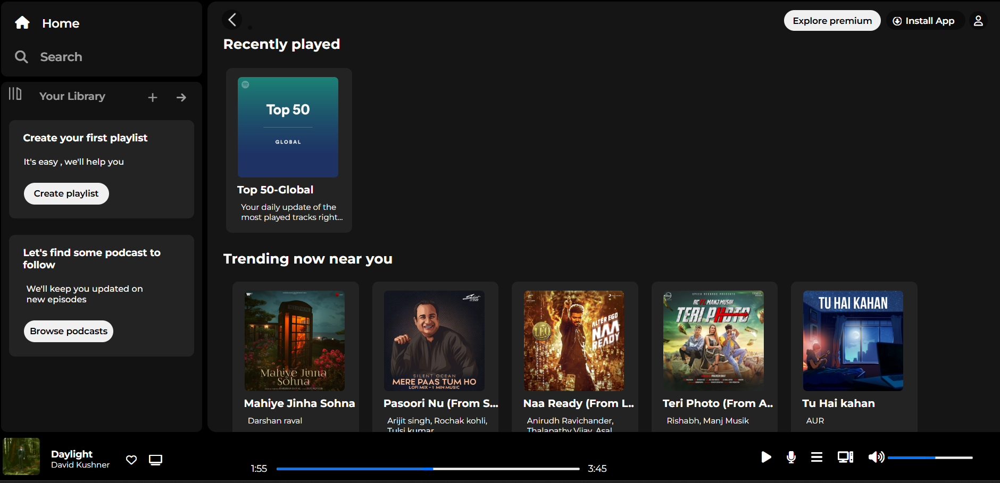
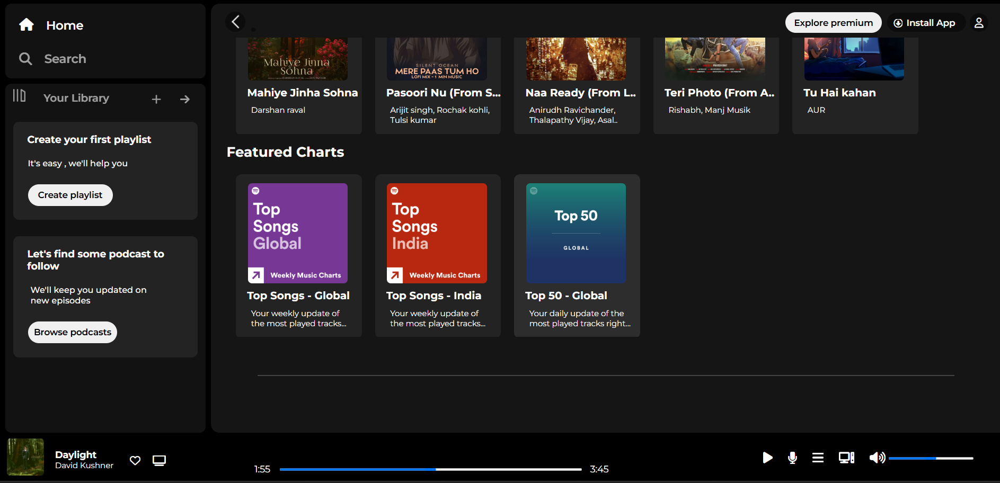

# Spotify Clone

## Overview
This is a frontend-only clone of Spotify, built using HTML and CSS. The project replicates the UI design of Spotify, including the layout, styling, and responsive design aspects.


## Project Link
You can view the live project by clicking the following link: [Spotify Clone](https://spotify-clone-3-zwe0.onrender.com)


## Features
- **Homepage UI**: A visually appealing homepage inspired by Spotify.
- **Navigation Bar**: Includes a sidebar and a top navigation menu.
- **Music Player UI**: A mock music player with basic controls (Play, Pause, Next, Previous).
- **Responsive Design**: Adjusts to different screen sizes for better usability.

## Technologies Used
- **HTML**: Structure of the web pages.
- **CSS**: Styling and layout.

## Screenshots



## How to Run
1. Clone the repository to your local machine:
    ```bash
    git clone https://github.com/NikkathZabeen/Spotify-clone.git
    ```
2. Open the `index.html` file in your browser to view the project.
